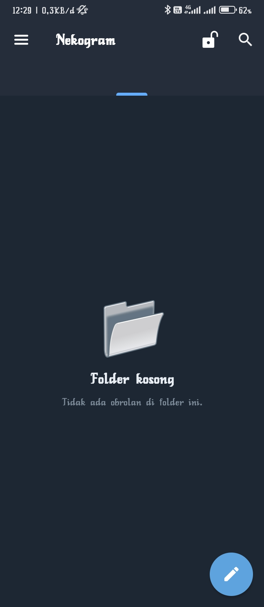
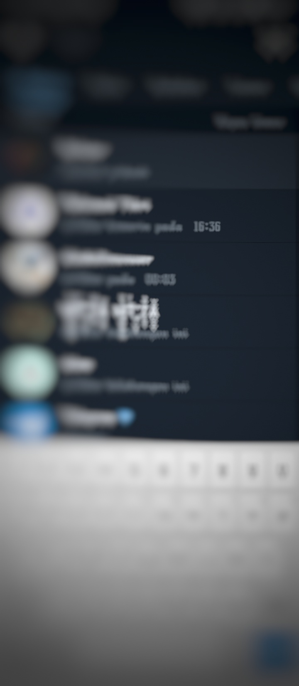
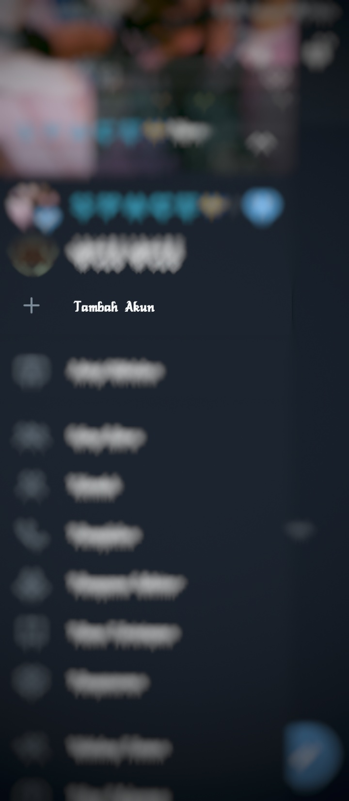

# simplest-telegram-interface

Simple telegram display custumization inspiration







Requirements:

- Install nekogram (Telegram client)

- Copy this char ```ㅤ ㅤㅤ```

Tutorial:

2. Copy the blank character and save in memo.

3. Delete all tabs, and Hide All tab in nekogram settings
 
4. Go to Tab/Folder settings in Nekogram apps.

5. Create a tab with the name :

(Press the blank character to be the tab name)

6. Create your own Channel or group and name it with a blank character.

7. Go back to the tab settings in the Nekogram application. Then select the only tab with the blank character.

8. Join the Channel or group you just created into this tab.

9. Leave your account from that channel or group. Do not remove the channel from the tab.

10. Tada!! Telegram with a minimalist look is ready to use. Use the pencil icon and magnifying mirror icon to start a chat.


Diterjemahkan dengan DeepL https://www.deepl.com/app/?utm_source=android&utm_medium=app&utm_campaign=share-translation
